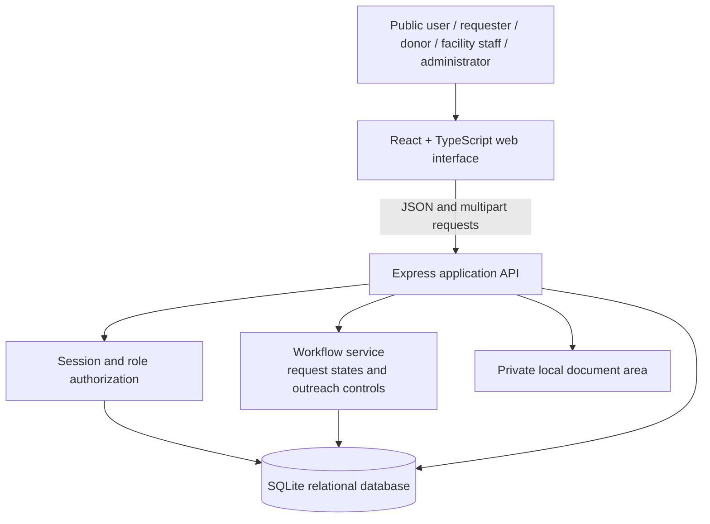
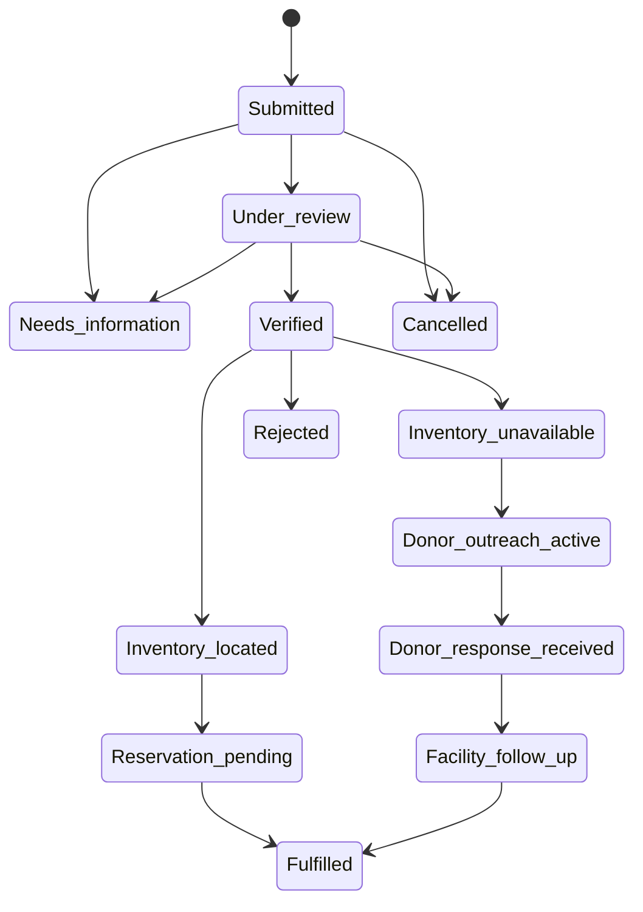

# System Architecture

## Architectural style

Raktakosh follows a three-layer web architecture. The presentation layer is a responsive React client. The application layer is an Express API responsible for validation, authorization, workflow transitions, and audit events. The persistence layer is a relational SQLite database used for the local academic implementation.

## Layer responsibilities

| Layer | Technologies | Responsibilities |
|---|---|---|
| Presentation | React, TypeScript, Vite, CSS | Responsive pages, forms, status timelines, bilingual public copy, role-based workspace navigation. |
| Application | Node.js, Express | Request validation, session management, authorization, status-transition enforcement, rate limiting, and API responses. |
| Data | SQLite | Facilities, users, availability, requests, donor preferences, campaigns, notifications, policies, and audit events. |
| File handling | Multer + private local storage | Controlled PDF/JPG/PNG upload metadata and integrity hash storage. |

## Request lifecycle

The API validates every transition; a client cannot directly skip from a newly submitted request to donor outreach.

## Core design decisions

1. **Role-aware access:** each workspace receives only the data and actions appropriate to its role.
2. **Qualified availability:** public results expose high-level, timestamped availability states rather than a promise of fulfilment.
3. **Auditable writes:** inventory adjustments, request changes, donor responses, and workspace access create audit records.
4. **Controlled outreach:** donor campaigns are available only after a request reaches the required inventory-unavailable state.
5. **Privacy-focused public layer:** public search excludes requester, donor, document, and internal-note data.
