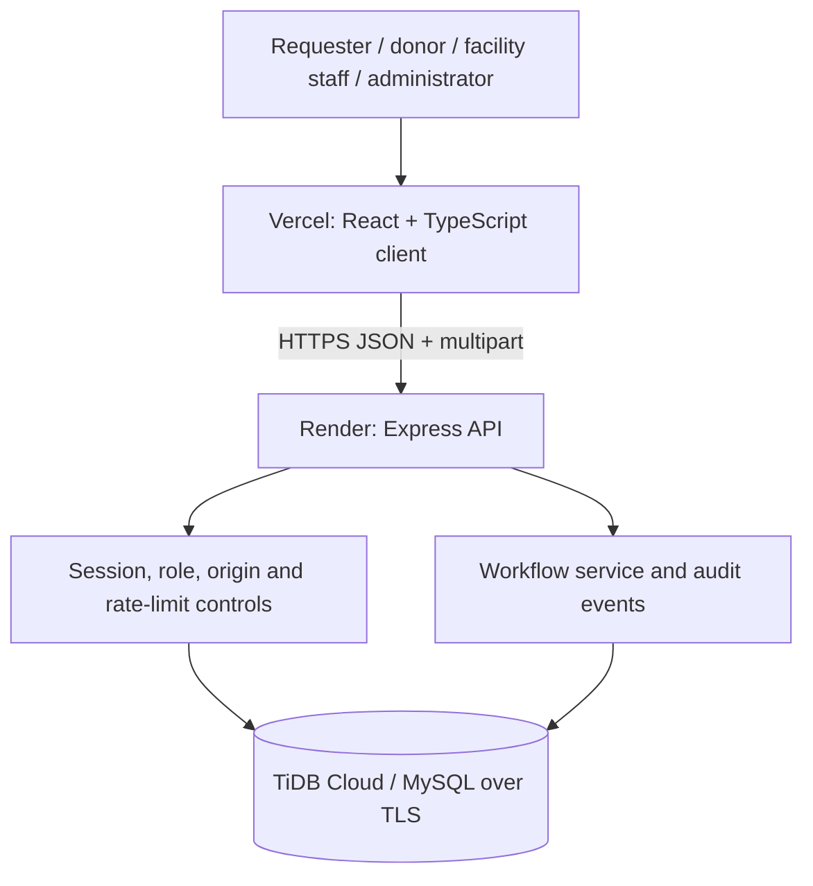

# System Architecture

## Architectural style

Raktakosh uses a three-layer web architecture. React/Vite provides the presentation layer, Express provides validation and workflow services, and TiDB Cloud provides MySQL-compatible relational persistence over TLS.

## Layer responsibilities

| Layer | Technologies | Responsibilities |
|---|---|---|
| Presentation | React, TypeScript, Vite | Responsive views, account access, request forms, availability search, and role-aware workspaces. |
| Application | Node.js, Express | Validation, session access, CORS/origin checks, rate limiting, request transitions, and audit generation. |
| Persistence | TiDB Cloud / MySQL | Facilities, accounts, inventory, requests, donor preferences, campaigns, notifications, policies, and audit events. |
| Hosting | Vercel + Render | Global frontend delivery and managed backend service deployment. |

## Security boundary

1. Vercel knows `VITE_API_BASE_URL` only.
2. Render alone stores `DATABASE_URL` and optional TiDB CA content.
3. The API accepts browser requests only from `FRONTEND_ORIGIN` in production.
4. Session cookies use `HttpOnly`, `Secure`, and cross-site cookie settings in production.
5. Server-side role checks enforce resource authorization; the UI is not trusted for permissions.
