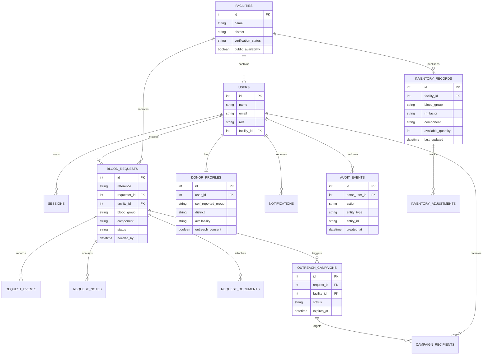

# Entity Relationship Diagram

## Data integrity rules

- `users.email` is unique.
- An inventory record is unique for each facility, group, Rh factor, and component combination.
- A request reference is unique and human readable.
- A donor has a maximum of one donor profile.
- A campaign recipient can only appear once within a campaign.
- Foreign-key constraints protect linked workflow records from orphaning.
